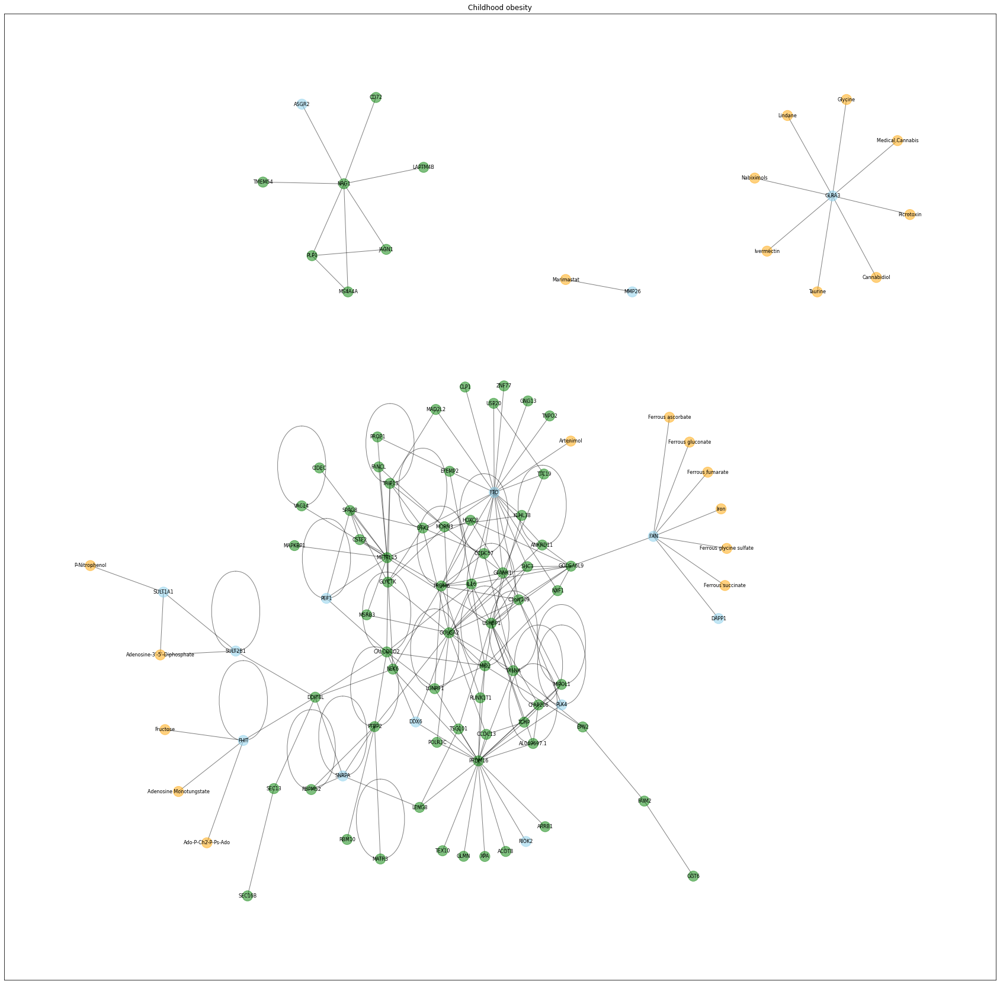
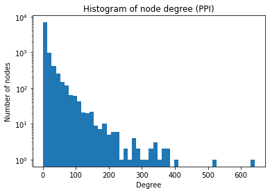
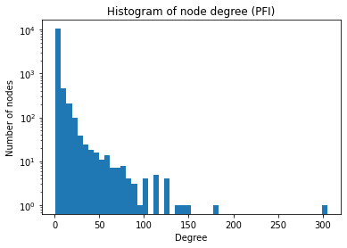
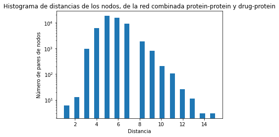

#  Genes y obesidad en niños. Nueva perspectiva, futuras soluciones.

---

###  ¿Obesidad y genes?

La obesidad es una enfermedad multifactorial, que es influenciada por el estilo de vida, factores ambientales, y genéticos. Representa un problema de salud pública a nivel mundial, existen **500 millones de adultos en el mundo con obesidad; en México, las estadísticas tampoco son alentadoras.** La obesidad en la infancia, predispone al desarrollo de diferentes enfermedades, como la hipertensión arterial, diabetes, lesiones articulares y un deterioro general de la calidad de vida. Sin embargo, se trata de una condición modificable, podemos prevenirla de muchas maneras y en este proyecto buscamos estudiarla desde el punto de vista genético, empleando recursos de programación, interpretación de redes y biología computacional. **Para poder prevenirla, hay que entenderla.**

Con los recursos de programación de Python, y con la guía de nuestros instructores **Jorge y Jeffrey** logramos representar y analizar un grupo de genes que se encuentran asociados a la obesidad en niños, con o sin condiciones agregadas como síndrome metabólico, desarrollo de neoplasias malignas e incluso el efecto de tratamientos durante la niñez que predisponen al desarrollo temprano de obesidad en la vida adulta. Mediante este proyecto buscamos nuevas formas de mejorar la vida de las personas  más jóvenes de la población, brindando un panorama más amplio.

---

###  ¿Cómo lo hicimos?

* Para desarrollar este proyecto, primero aprendimos las bases del manejo, interpretación y visualización de redes durante las sesiones, con el uso de Python y paqueterías como Pandas y Network X.  Creamos un proyecto de colaboración utilizando Google Colab, y todas las tardes nos reunimos a crear las redes necesarias para elegir una lista de genes y fármacos que interactuan.
* Dentro de esto, determinamos distintas propiedades de los integrantes de estas redes, los más relevantes, aquellos con mayor número de interacciones a partir de la representación de gráficos como el siguiente.

 * En este gráfico podemos observar la red en la que las lineas conectando cada uno de los elementos representan una interación bidireccional con otros elementos, es decir, la interacción entre fármacos y genes.
 
---

###  Resultados

* Red **proteína-proteína**

* Red **de proteínas-fármacos**

* En este proyecto logramos encontrar **tres propuestas de fármacos, proteínas y genes más relevantes en la obesidad infantil**

* El top 5 de los nodos con mayores interacciones en esta red de **interacciones entre proteínas**, *(PPI), que significa "Protein-Protein interactions"* son: 
  1. MEOX2; 
  2. CYSRT1; 
  3. GOLGA2; 
  4. LNX1; 
  5. KRTAP10-8

* El top 5 de los nodos con mayores interacciones en esta red de **interacciones entre fármacos y proteínas,** *(PDI), que significa "Protein-Drug-Interactions"* son: 
 1. Fostamatinib; 
 2. Artenimol; 
 3. Copper 
 4. NADH; 
 5. CDK2

* El top 5 de los nodos con mayores interacciones en esta red combinada (G_Combined_Networks) son: 
 1. MEOX2; 
 2. CYSRT1; 
 3. GOLGA2; 
 4. LNX1; 
 5. KRTAP10-8.

* Por distancia podemos decir que poco menos de 10 fármacos tienen relación directa con un gen/proteína por lo que podemos decidir entre alguno de estos, aunado a que al mismo tiempo estos genes proteínas están relacionados con muchos otros más.

---

###  Conclusiones

* Con todo lo anterior podemos decir que nuestros tres candidatos para fármacos que pueden ayudarnos a encontrar nuevas rutas terapéuticas para el tratamiento de la obesidad infantil, estos son: 
 1. Monotungstato de Adenosina (Adenosine monotungstate, FHIT);
  
 2. Fumarato ferroso (ferrous fumarate, FXN);
  
 3. Artenimol(FTO)

---

###  Nuestro Video

 * Como parte del proyecto hemos realizado un video en donde explicamos nuestro increíble proceso, desde que conocimos a nuestros compañer@s e instructores hasta concluirlo [nuestro video](https://youtu.be/S7fpdukg8OE).

---
 
###  Equipo, equipazo.

---
* Valeria Martinez Barco:
  - ¡Hola! Me llamo Valeria, tengo 16 años y soy del Estado de México. Me encuentro cursando el tercer semestre de bachillerato en la Escuela Nacional Preparatoria Plantel. Soy una persona que está especialmente atraída a las ciencias como la Física y la Biología; por eso me decidí a partícipe el Clubes de Ciencia México por primera vez. 

---
* Citlali Bautista Santibañez: 
  - ¡Hola! Mi nombre es Citlali Bautista Santibañez, tengo 16 años y soy originaria del estado de Oaxaca. Actualmente curso el tercer semestre de bachillerato en el Plantel 04 del Colegio de Bachilleres del estado de Oaxaca. Estoy muy interesada en las ciencias biológicas y  la química; por lo que por primera vez soy participe de Clubes de Ciencia México.

---
* Carlos Johan Rodríguez Sánchez: 
  - Hola, mi nombre es Johan, nací en San Juan Bautista Valle Nacional, Oaxaca. Esta es mi segunda edición en Clubes de Ciencia, una experiencia completamente distinta ya que soy estudiante de Medicina y nunca esperé integrarme al mundo de la programación. He aprendido mucho de nuestros instructores y de nuestro equipo, estoy seguro de que con este conocimiento ahora tendré una nueva forma de resolver problemas en mi carrera.

---
* Eva Kryshna Mayoral Salazar: 
  - Hola, mi nombre es Eva Kryshna Mayoral Salazar, soy de Huajuapan de León, Oaxaca, actualmente termine la preparatoria,  y entre a esta edición de clubes de México debido a que a raíz de la pandemia pude prestarle más atención a los problemas que tenemos como sociedad, sin embargo no los terminaba de entender, y en clubes de ciencia con ayuda de los instructores pude comprender un poco más sobre uno de los principales problemas en México, que es la obesidad, y ahora creo que estoy un poco más preparada para ayudar y concientizar.

---
* Dalia Gabriela Sánchez Sánchez:  
  - ¡Hola! Soy Dalia, tengo 22 años, soy oaxaqueña y estudio el quinto año de la carrera de medicina en la UABJO, en Oaxaca. Soy ya una veterana de Clubes de Ciencia, puesto que desde mi primer edición a los 16 años, quedé enamorada de la ciencia y del programa, espero el proyecto de esta edición les despierte tanto interés como a nosotros. 
---

